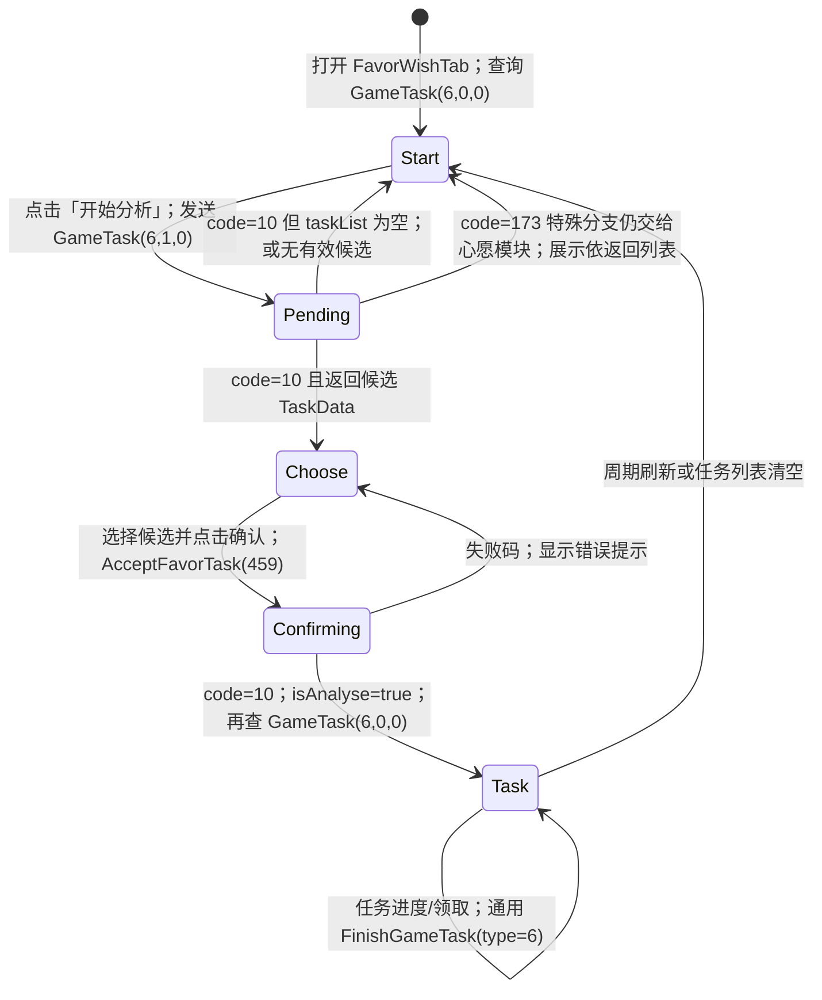

# 终端 / 心愿分析客户端状态机

入口为 `MainPage.mBtnPrivateLetter` → `PrivateMailModule.Show` → `FavorCommunityMain` (`UI_PrivateMail`) → `FavorWishTab`。容器另有私信和动态 Tab；「开始分析」只属于心愿任务 Tab。

`FavorWishTab` 在 `RefreshFavorWish @ 0x18BB5F8` 先关闭三个页面，然后由 `CalPageState @ 0x18BB6B4` 返回 `None=0`、`Select=1`、`Task=2`，分别打开 `OpenStartPage @ 0x18BB888`、`OpenChoosePage @ 0x18BB8B8`、`OpenTaskPage @ 0x18BBAD8`。客户端不是倒计时/抽卡式分析；下一步是**候选心愿任务选择页面**，确认后是任务列表。候选数、每日生成概率、刷新时点需要服务器规则和静态表交叉复原，不能从空响应自行设定。

`L2C_GameTask` 的 `taskList` 元素是 `TaskData`，含 `taskId`、`taskStatus`、`taskProgress`、`taskRefreshTime`、`finishTimes`、`stage` 等。`TaskStatus` 为 `WAITING=0`、`UNLOCK=1`、`START=2`、`REWARD=3`、`FINISH=4`。`FavorWishModule.OnReceiveFavorWishMsg @ 0x18B9B6C` 将返回列表写入模块并发 UI 刷新事件 218。`OnReceiveAcceptFavorWishMsg @ 0x18BA1CC` 在 `code=10` 后改 `isAnalyse` 并重查任务。

关联静态表：`LanguageUI`（261、4908、4909）；`FunctionOpen`（`ID=21942`、`E_FavorabilityTask`、20 级开放）；`FavorabilityDailyTask`（351 条，含 TaskID/TaskCondition/HeroID/FavorabilityGift/GiftGroup/文案/JumpID）；`FavorabilitySpecialTask`（4 条，另一路 `FAVORSPECIAL=5`）；`TaskCondition`（完成条件）；`Gift`（奖励组）；`PrivateMail` / `PrivateMailControl` / `PrivateMailSystem`（同一终端容器的私信子系统，不能拿来替代心愿分析任务规则）。

当前服务端对 `C2L_GameTask(type=6)` 返回 `code=10` 且无 `taskList`，并忽略 `extraType=GENMIND`，因此客户端可合法回到 StartPage。这与用户看到按钮似乎无反应相符，但只是代码路径解释，不是本轮运行时实测；按钮点击的真实包仍可用 telemetry 交叉确认。
