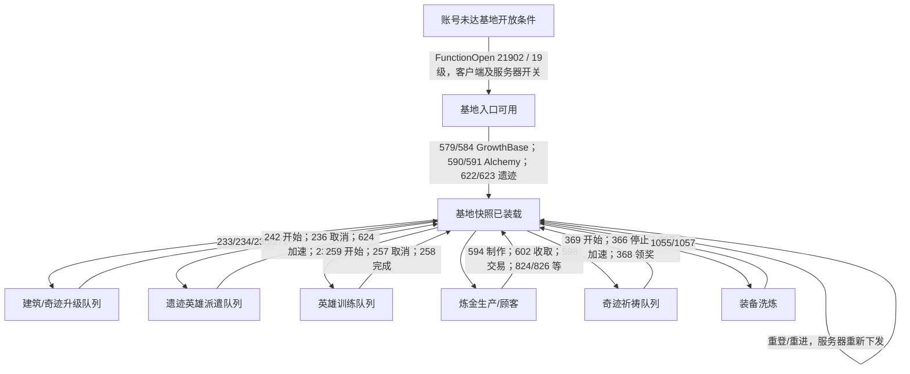
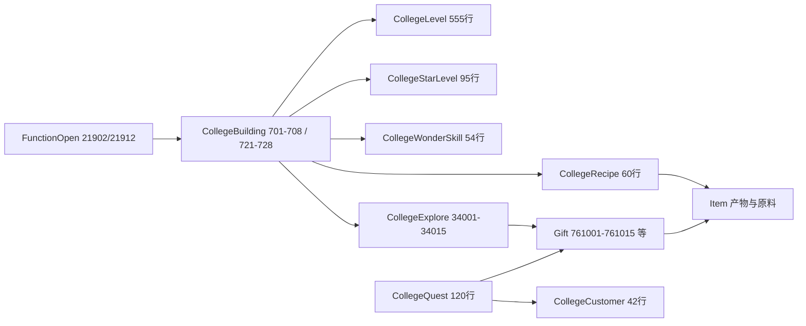

# 白夜行星（College/GrowthBase）状态机

证据等级：A=官方客户端类型/发送函数/静态行，B=这些证据联立推断，UNKNOWN=原服务器规则缺失。它是多个并行队列的基地，不存在单一“选择关卡→战斗→结算→下一关”线性状态机。

| 状态/转换 | 客户端缓存与 UI | 服务器必须持久化 | 来源 |
|---|---|---|---|
| 解锁 | 入口按钮取 `FunctionOpen` 与 `IsClientFunctionClose/IsServerFunctionClose`；基地 19 级、奇迹 25 级 | 账号等级、功能开关；具体剧情门若存在仍待核实 | A/B |
| 基地装载 | `CollegeModule.growthData`（`L2C_QueryGrowthBase`）、建筑/奇迹列表、星能、金币仓库、额外体力、各队列及计时 | 这些账户状态及上次结算时间 | A |
| 建筑升级/升星 | `BuildingBaseInfo`、`BuildQueue`；等级/星级效果由 `CollegeLevel`/`CollegeStarLevel` 展示 | 已建等级/星级、花费、队列开始/结束、完工领取标记 | A/B；官方资源价格 UNKNOWN |
| 派遣开始 | `C2L_StartExplore` 传 `exploreId/diffdifficulty/heroIds/ruinId`；本地显示倒计时 | 派遣实例、角色占用、难度、遗迹、消耗、结束时间；防重复 | A |
| 派遣完成/取消/加速 | `ExploreData` 与 `L2C_FinishExplore.rewardData/ruinId/exp` 刷 UI | 领奖账本、遗迹经验/解锁、时间、资源退还规则 | A/B；退还细则 UNKNOWN |
| 训练开始/完成/取消 | `TrainingData`、英雄经验、倒计时 | 训练槽、英雄占用、结束时间、经验发放账本 | A |
| 炼金生产/交易 | `L2C_AlchemyMainData` 的配方经验/顾客/生产槽/元素/增益 | 材料扣除、订单、生产队列、配方经验、顾客交互及奖励账本 | A |
| 奇迹祈祷 | `WonderQueue`、`PrayQueue`、选中奇迹索引；`L2C_PrayEnd(514)` 可提示完工 | 奇迹等级/星级、祈祷英雄与材料、结束时间、领取账本 | A |
| 装备洗炼 | `washingCountDay`、装备属性 | 日次数、锁定/随机结果、材料消耗、装备实例属性 | A |
| 重登 | 本地 `CurWonderIndex` 与最近配方只是 UI 偏好 | 从服务器重建全部增长、计时、占用及领奖状态；`L2C_Login.growthBase` 与 579/584 应一致 | A/B |

## 静态关系

`CollegeExplore.Reward` 引用 Gift 组，`ProduceID` 引用 Item，`PowerConsume/WaitTimes` 给派遣静态成本与时长。`CollegeRecipe` 的 `ItemGroup/ItemNum/ProductID/ProductNum/WaitTimes` 给炼金材料、产物与等待。`CollegeQuest.AwardGroup` 只有 `AwardType=E_Gift` 时引用 Gift；`E_Gold` 和 `E_Buff` 行存数值参数。`CollegeEquibReset` 提供洗炼材料选项。完整关联 ID 清单见 `static_catalog.json`。

## 奖励与资源边界

- **派遣奖励**：`CollegeExplore.Reward` 指向 Gift；`L2C_FinishExplore(250).rewardData` 是服务器授权交付。`ruinId/exp` 另有遗迹进度，不得直接由客户端声明的 `exploreId` 代替。
- **炼金**：`L2C_AlchemyCollect(603)` 和 `L2C_AlchemyFinish(599)` 含 `rewardData`；一键收取 `827` 也含 `rewardData/barData`。交易售价修正字段 `plusPrice/discountPrice` 属请求值，服务器须验证，不能信任客户端算出的收益。
- **祈祷**：`L2C_BuildRewardPrayGod(372).rewardData`，与 `514 PrayEnd` 到时通知分离。
- **洗炼**：`1056/1058` 下发装备属性与日次数；随机与扣费要事务化，不能把预览属性直接写入装备。
- **资源**：`starEnergy/extraPower/warehouseGold` 在 GrowthBase 回包；`CollegeExplore.PowerConsume`、`CollegeRecipe` 材料/Gold/Pay 为客户端静态提示。星能生成速率、上限、取消退费、加速价格及建造真实消耗若未从客户端算法闭环，均标 `SERVER_ONLY_UNKNOWN`。

## 非战斗、非赛季证据

`StartExplore(242)` 是定时派遣；15 个 `CollegeExplore.ID` 不等于任何 `SectionID`。当前证据没有 College → `FightData 126/130` 或 `Checkout 887/152` 链，没有基地专属赛季 ID、排行榜或赛季奖励协议。`ActivityID 28001` 是另一个活动表，不能嫁接到 College。基地里的“训练”是英雄占用/经验计时；独立 TrainingGround 战斗也不能混入本状态机。周期边界当前只见计时队列和 `washingCountDay`，其官方重置时刻未从这些静态行单独证明。

## 当前 Revival 与实现边界

Revival 的 `growth_base_values()` 固定 701–708 和 721–727 为 1 级，并把若干嵌套队列编码为空；579/584 返回同一模板，622/623 固定错误 13。它可帮助页面初始化，但没有持久化星能、建筑/奇迹升级、派遣、训练、炼金、祈祷或洗炼。**“入口出现”不代表任何分支完成**。第 728 座奇迹“泰姬陵”静态行缺 `BuildingOpen`，不能据此全解锁。后续实现必须先决定缺失的官方服务器规则并标为 Revival 兼容策略。
